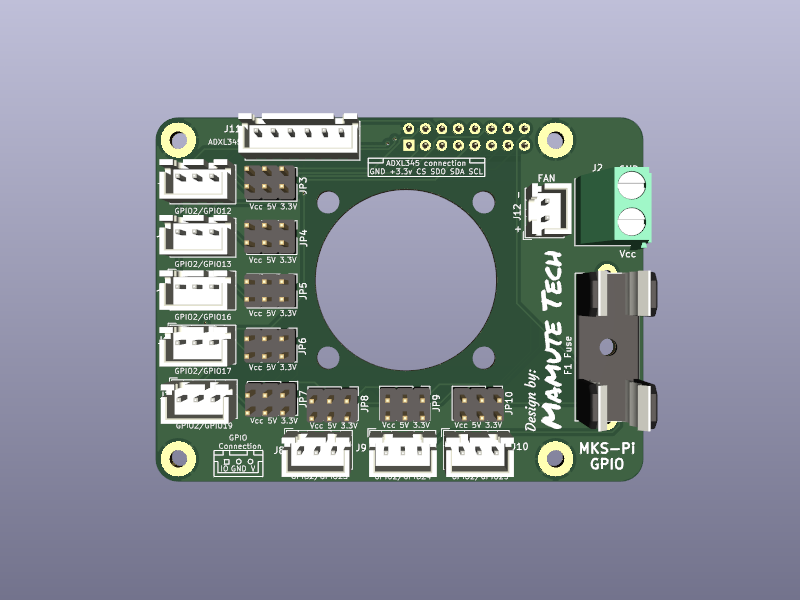

# Carte MKS-PI Hat GPIO

Projet de carte Hat pour le MKS-Pi afin de simplifier l'utilisation des GPIOs
    - Accès à la connectique ADXL345 via un connecteur JST-XH2.5 6 contacts
    - Accès aux 8 GPIOs via des connecteurs JST-XH2.5 3 contacts
    - Possibilité de choisir la tension sur les connecteurs IO
        - 3.3V interne au MKS-Pi
        - 5V interne au MKS-Pi
        - Tension externe via bornier à vis, protection par un fusible a dimensionner en fonction de la tension et de l'utilisation
    - Ventillateur de refroidissement alimenté par le 5v du MKS-Pi (prévu pour un 30x30)

# MKS-PI Hat GPIO card

Hat card project for MKS-Pi, to simplify GPIOs acces
    - ADXL345 connection with JST-XH2.5 6 contacts
    - 8 GPIOs acces with JST-XH2.5 3 contacts
    - Choose power voltage for IO connectors
        - MKS-Pi internal 3.3V
        - MKS-Pi internal 5V
        - External power from Screw terminal block with fuse protection which will be choose by use and voltage
    - Cooling fan powered by MKS-Pi 5V (30x30mm)